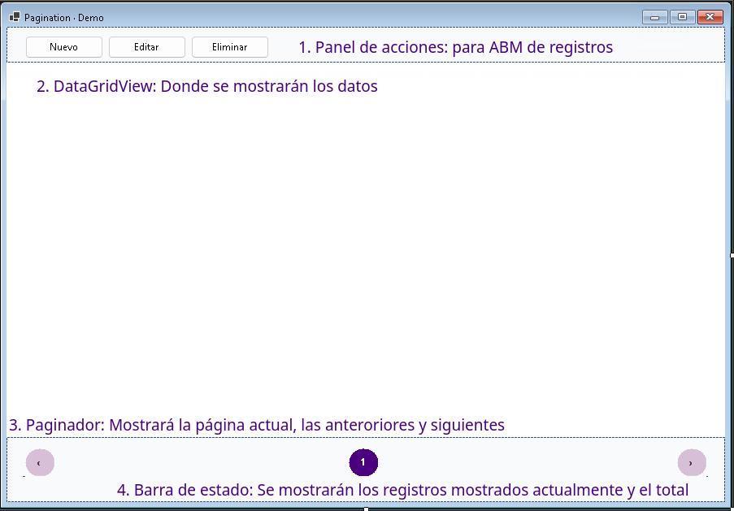

# Paginación en una aplicación WinForms

## Resúmen

Esta guía muestra cómo se construyó la paginación de una aplicación WinForms que lista clientes. La tabla `Clientes` tiene 123 filas y se muestran en un `DataGridView`.  
Traerlas todas de una sola consulta y dejar que la grilla se las arregle es una opción, pero implica viajar 123 filas por la red cada vez que se abre la ventana, y esa cantidad solo va a crecer con el tiempo. Por eso aplicamos paginación: se piden bloques de 10 registros, se muestran botones para moverse entre páginas, y la base de datos hace el trabajo de recortar el bloque que corresponde en cada momento. Con 123 clientes y 10 por página, el resultado son 13 páginas: las primeras 12 completas y la última con 3.

Antes de entrar en el código, se repasan algunas ideas de C# y ADO.NET que aparecen todo el tiempo más abajo y que quizás no se vieron todavía en la cursada. Si ya son conocidas, se puede saltar directamente a [Pensando primero en la base de datos](#pensando-primero-en-la-base-de-datos).

## Conceptos a tener en cuenta utilizados en este ejemplo

### Conexión y comando SQL (ADO.NET)

Trabajaremos con dos objetos principales de ADO.NET, la librería que nos permite interactuar con bases de datos relacionales:

- `SqlConnection`: representa la conexión abierta hacia el servidor de base de datos (dirección, usuario, base a usar, etc.). Sin una conexión abierta no se puede ejecutar ninguna instrucción.
- `SqlCommand`: representa una instrucción SQL puntual (un `SELECT`, un `INSERT`, etc.) que se ejecuta sobre esa conexión. Se obtiene con `connection.CreateCommand()` y su texto se define en la propiedad `CommandText`.

Una vez armado el comando, existe un método distinto según lo que se espera como resultado:

| Método              | Cuándo se usa                                                | Qué devuelve                                                                |
| ------------------- | ------------------------------------------------------------ | --------------------------------------------------------------------------- |
| `ExecuteScalar()`   | La consulta devuelve un único valor                          | Ese valor (por ejemplo, el resultado de `COUNT(*)`)                         |
| `ExecuteReader()`   | La consulta devuelve varias filas                            | Un `SqlDataReader` para recorrerlas una por una con `while (reader.Read())` |
| `ExecuteNonQuery()` | La instrucción modifica datos (`INSERT`, `UPDATE`, `DELETE`) | La cantidad de filas afectadas; no hay filas para leer                      |

> `ExecuteScalar` devuelve un único valor, como el resultado de `COUNT(*)`. `ExecuteNonQuery` se usa cuando la instrucción no devuelve filas para leer, solo la cantidad de filas afectadas.

### Consultas parametrizadas

En vez de armar el SQL concatenando texto —por ejemplo `"SELECT * FROM Clientes WHERE Id = " + id`—, se escriben marcadores como `@id` dentro del `CommandText` y se les asigna un valor por separado con `command.Parameters.AddWithValue("@id", id)`.

```csharp
command.CommandText = "SELECT * FROM Clientes WHERE Id = @id";
command.Parameters.AddWithValue("@id", id);
```

Esto tiene tres ventajas frente a concatenar strings:

1. **Es SQL Puro**: el uso de variables con `@` es propio del lenguaje SQL.
2. **Seguridad:** evita la _inyección SQL_, un ataque donde un usuario malicioso escribe SQL dentro de un campo de texto para alterar la consulta original.
3. **Correctitud:** evita errores de formato al mezclar texto SQL con comillas, fechas o números, que ADO.NET resuelve automáticamente según el tipo del parámetro.

### `using` e `IDisposable`

Algunos objetos representan recursos "caros" que el sistema operativo debe liberar explícitamente cuando se dejan de usar: conexiones de red, archivos abiertos, handles, etc. En .NET, esos objetos implementan la interfaz `IDisposable`, que define un método `Dispose()` (de "deshacerse de algo", no de "disponer") para liberarlos.

`SqlConnection` es uno de esos objetos. En vez de llamar a `Dispose()` a mano —con el riesgo de olvidarlo si ocurre una excepción en el medio—, se usa la palabra clave `using`:

```csharp
using var connection = new SqlConnection(connectionString);
connection.Open();
// ... usar la conexión ...
// Dispose() se llama automáticamente al salir del bloque, incluso si hubo una excepción.
```

Por eso aparece `using var connection = ...` y `using var command = ...` en casi todos los métodos del repositorio.

> **Ojo con una fuente común de confusión:** la palabra `using` se usa en C# para dos cosas completamente distintas. Arriba de todo del archivo, `using System;` importa un espacio de nombres (namespace). Acá, `using var connection = ...` es otra cosa: un _statement_ que garantiza la liberación del recurso. Se llama igual por casualidad del diseño del lenguaje, pero no tienen relación entre sí.

### Suscribirse a un evento con una lambda, sin pasar por el Designer

Hasta ahora, la forma habitual de manejar un evento fue doble clic sobre un control en el Diseñador: Visual Studio genera un método (por ejemplo, `button1_Click`) y lo suscribe automáticamente en `InitializeComponent()`. Esa no es la única manera de hacerlo. El mismo `+=` que se usa ahí se puede escribir a mano en el constructor, pasando directamente una expresión **lambda** en vez de un método con nombre:

```csharp
_paginator.PageChanged += (_, args) => LoadPage(args.Page);
```

Esa línea logra lo mismo que hacer doble clic en el Diseñador, pero sin generar un método aparte ni tocar el archivo `.Designer.cs`: se lee como "cuando `_paginator` dispare `PageChanged`, ejecutá `LoadPage(args.Page)`". La lambda `(_, args) => ...` recibe los dos parámetros que trae `EventHandler<PageChangedEventArgs>` (el `sender` y los datos del evento); el `_` es un _discard_ que indica que ese parámetro no se necesita —en este caso, el `sender`—, mientras que `args` sí se usa para leer `args.Page`.

Esta forma es útil cuando el evento se suscribe a un control que no viene del Diseñador (como pasa más abajo con `_paginator`, que es un `UserControl` propio) o simplemente cuando conviene mantener la lógica junto al resto del constructor en vez de repartirla en dos archivos.

### `sealed`

El modificador `sealed` marca una clase (o un `record`) como **no heredable**: ninguna otra clase puede escribir `class Otra : ClienteRepository`. Se usa así:

```csharp
public sealed class ClienteRepository(string connectionString)
{
    ...
}

public sealed record Cliente(long Id, string Name, string Email, string City);
```

En este proyecto casi todas las clases están marcadas como `sealed` (`Cliente`, `ClienteRepository`, `PaginationStyle`, `PageChangedEventArgs`) porque ninguna fue diseñada para ser una clase base: no tienen miembros `protected` ni `virtual` pensados para que una subclase los redefina. Esto trae dos beneficios:

- **Comunica la intención:** cualquiera que lea el código sabe que esa clase se usa "tal cual", sin extenderla.
- **Evita errores de herencia accidental:** nadie puede heredar de `ClienteRepository` y romper su comportamiento interno sin darse cuenta.

Si más adelante alguna clase necesitara ser extendida, alcanza con quitarle el `sealed`.

## Qué es paginar y cuándo conviene

Paginar es dividir un conjunto grande de datos en bloques (páginas) y trabajar con un bloque por vez, en lugar de traer y mostrar todo de una sola vez. Es una técnica común en cualquier lista larga —clientes, productos, pedidos, resultados de búsqueda— que aparece tanto en aplicaciones de escritorio como en sitios web y APIs.

Conviene paginar cuando:

- La cantidad de registros es grande o va a seguir creciendo con el tiempo (una tabla con 100 filas hoy puede tener 100.000 mañana).
- Solo hace falta mostrar una porción a la vez, como ocurre en un `DataGridView`, una lista en una página web o los resultados de un buscador.
- Traer todo junto sería lento o consumiría demasiada memoria, tanto en el cliente como en el servidor.

No tiene mucho sentido paginar cuando el conjunto de datos es chico y estable —por ejemplo, una lista fija de 20 categorías—, porque ahí el costo de agregar la lógica de paginación supera el beneficio.

Antes de tocar WinForms conviene definir qué se le va a pedir a SQL Server, porque toda la paginación depende de eso. Hay dos preguntas para resolver:

1. ¿Cuántos registros hay en total? Sin ese número no se puede calcular cuántas páginas existen ni mostrar el estado de la grilla.
2. ¿Qué registros corresponden a la página que el usuario está mirando? La consulta tiene que devolver solo ese bloque, nunca la tabla completa.

En nuestro ejemplo, la tabla `Clientes` tiene esta estructura:

| Columna | Tipo                      | Descripción                                       |
| ------- | ------------------------- | ------------------------------------------------- |
| `Id`    | `BIGINT` (PK, `IDENTITY`) | Identificador único del cliente, autoincremental. |
| `Name`  | `NVARCHAR(200)`           | Nombre del cliente.                               |
| `Email` | `NVARCHAR(320)`           | Correo electrónico del cliente.                   |
| `City`  | `NVARCHAR(100)`           | Ciudad del cliente.                               |

Para traer el bloque correcto, la aplicación necesita saber cuántos registros hay que saltear antes de empezar a leer la página pedida. Ese número se llama **desplazamiento** (_offset_), y es simplemente la cantidad de registros que ocupan todas las páginas anteriores a la actual:

```
offset = (page - 1) * pageSize
```

Por ejemplo, con páginas de 10 registros: la página 1 no salta nada (offset 0, porque no hay páginas anteriores), la página 2 salta la página 1 completa (offset 10), y la página 3 salta las dos páginas anteriores (offset 20). Este cálculo se hace una sola vez en la aplicación, antes de armar la consulta.

Primero se pide el total. Si la grilla tuviera filtros, el `WHERE` de esta consulta tendría que ser idéntico al de la consulta de la página, porque si no los números no coinciden entre sí.

```sql
SELECT COUNT(*) AS TotalRegistros
FROM Clientes;
```

Para traer la página en sí, se usa `OFFSET ... FETCH NEXT`, que es la forma que ofrece SQL Server para este tipo de recorte. El `ORDER BY` acá no es opcional: sin un orden estable, la noción de "página 3" no significa nada, porque el motor podría devolver las filas en cualquier orden entre una consulta y la siguiente.

```sql
SELECT Id, Name, Email, City
FROM Clientes
ORDER BY Id
OFFSET @Desplazamiento ROWS
FETCH NEXT @TamanoPagina ROWS ONLY;
```

Con offset 20 y tamaño 10, SQL Server descarta los primeros 20 clientes ordenados por `Id` y devuelve los siguientes 10: los registros 21 a 30. Con un total de 123, la cantidad de páginas sale de `CEILING(123.0 / 10)`, o sea 13.

El patrón se repite siempre igual: se cuenta, se calcula el desplazamiento, se ordena y se pide solo el bloque necesario. Con esto resuelto del lado de la base, se puede pasar a la aplicación.

## Armando las piezas

Para que esto funcione en WinForms se necesitan tres piezas que se reparten el trabajo:

| Componente          | Responsabilidad                                                                 |
| ------------------- | ------------------------------------------------------------------------------- |
| `ClienteRepository` | Cuenta los registros y obtiene los clientes de una página desde SQL Server.     |
| `Paginator`         | Crea los botones de página, calcula las páginas visibles y emite `PageChanged`. |
| `MainForm`          | Coordina la consulta, el `DataGridView`, el paginador y el texto de estado.     |

### Cómo está organizado el proyecto

Antes de entrar en cada pieza, conviene mirar cómo se acomodan los archivos dentro de `PaginationDemo`, porque los nombres de carpetas y de clases no son arbitrarios: siguen convenciones habituales en proyectos .NET que ayudan a ubicar rápido dónde vive cada responsabilidad.

```
PaginationDemo/
├── Data/
│   └── ClienteRepository.cs
├── Models/
│   └── Cliente.cs
├── Views/
│   ├── Forms/
│   │   ├── MainForm.cs
│   │   ├── MainForm.Designer.cs
│   │   ├── ClienteEditForm.cs
│   │   └── ClienteEditForm.Designer.cs
│   └── UserControls/
│       ├── Paginator.cs
│       ├── Paginator.Designer.cs
│       ├── PaginationStyle.cs
│       └── PageChangedEventArgs.cs
└── Program.cs
```

- **`Models/`**: guarda las clases que representan datos, sin lógica de acceso a la base ni de interfaz. `Cliente` es un `record` con las propiedades `Id`, `Name`, `Email` y `City`: nada más que eso.
- **`Data/`**: guarda las clases que saben hablar con la base de datos. Por convención, una clase que centraliza el acceso a una tabla o entidad se llama `<Entidad>Repository` —de ahí `ClienteRepository`—, siguiendo el **patrón Repository**: el resto de la aplicación le pide clientes a `ClienteRepository` sin necesidad de saber que atrás hay SQL, `SqlConnection` o `SqlCommand`. Si el día de mañana se cambiara de SQL Server a otro motor, en teoría alcanzaría con reescribir esta clase.
- **`Views/`**: agrupa todo lo relacionado con la interfaz gráfica. Adentro se separa por tipo de control:
  - **`Forms/`**: las ventanas completas de la aplicación, `MainForm` y `ClienteEditForm`. Por convención, cada una termina en `Form` (o se llama directamente `MainForm` cuando es la ventana principal).
  - **`UserControls/`**: controles reutilizables como `Paginator`, que no son una ventana completa sino un componente que se inserta dentro de otras ventanas.
- **`Program.cs`**: es el punto de entrada de la aplicación (el método `Main`), que arranca WinForms y muestra el primer formulario.

Ninguna de estas convenciones es obligatoria para que el código compile: son acuerdos que facilitan que cualquiera que conozca el patrón Repository o la estructura típica de un proyecto WinForms pueda orientarse sin tener que leer todo el código primero.

### La conexión a SQL Server

Se usa el proveedor `Microsoft.Data.SqlClient`, así que lo primero es agregar la referencia al paquete:

```xml
<PackageReference Include="Microsoft.Data.SqlClient" Version="6.1.0" />
```

Antes de correr nada hace falta una base SQL Server y su cadena de conexión. La aplicación se encarga de crear la tabla `Clientes` cuando arranca, así que no hace falta scriptearla a mano.

La configuración se guarda en un archivo `src/PaginationDemo/.env`. Se puede crear copiando `src/PaginationDemo/.env.example` y completando los valores:

Un archivo `.env` es un formato simple y extendido para guardar configuración como pares `NOMBRE=valor`. Se usa para separar datos que cambian según cada computadora —por ejemplo, una conexión a la base— del código fuente y para no versionar credenciales.

```dotenv
PAGINATION_DEMO_CONNECTION_STRING="Server=(localdb)\MSSQLLocalDB;Database=PaginationDemo;Integrated Security=True;TrustServerCertificate=True"
PAGINATION_DEMO_SEED=true
```

El archivo `.env` se copia junto al ejecutable y se carga al iniciar la aplicación. Está ignorado por Git para no compartir datos de conexión; el archivo `.env.example` sí se versiona como plantilla.

`Program` lee el archivo antes de abrir el formulario y deja cada valor disponible como una variable de entorno del proceso:

```csharp
LoadEnvironmentFile();
Application.Run(new MainForm());
```

Después, `MainForm` obtiene la cadena ya cargada y se la pasa al repositorio. Si falta, la aplicación falla rápido con un mensaje claro, en vez de arrastrar el problema más adelante:

```csharp

var connectionString = Environment.GetEnvironmentVariable(
    "PAGINATION_DEMO_CONNECTION_STRING");
if (string.IsNullOrWhiteSpace(connectionString))
    throw new InvalidOperationException("Creá src/PaginationDemo/.env con la conexión a SQL Server.");

_repository = new ClienteRepository(connectionString);
_repository.Initialize();
```

En `MainForm` también se declara una constante para el tamaño de página, porque la misma cantidad se necesita tanto para consultar la base como para calcular las páginas:

```csharp
private const int PageSize = 10;
```

### El repositorio: contar y traer una página

Con la conexión resuelta, el repositorio necesita exactamente dos operaciones:

1. `Count()`, que devuelve el total de filas para calcular cuántas páginas existen.
2. `GetPage(page, pageSize)`, que trae solo el bloque que corresponde a la página pedida.

Para esta segunda consulta se usan parámetros para enviar el tamaño y el desplazamiento: `connection.CreateCommand()` crea el `SqlCommand`, `command.CommandText` lleva el SQL, y `command.Parameters` reemplaza a `@offset` y `@pageSize` (ver [Conceptos previos](#conceptos-previos) si esto no resulta familiar). El método devuelve `IReadOnlyList<Cliente>` porque quien lo llama solo necesita leer la lista, no modificarla.

```csharp
public IReadOnlyList<Cliente> GetPage(int page, int pageSize)
{
    using var connection = new SqlConnection(connectionString);
    connection.Open();
    using var command = connection.CreateCommand();
    command.CommandText = "SELECT Id, Name, Email, City FROM Clientes " +
                          "ORDER BY Id OFFSET @offset ROWS " +
                          "FETCH NEXT @pageSize ROWS ONLY";
    command.Parameters.AddWithValue("@pageSize", pageSize);
    command.Parameters.AddWithValue("@offset", (page - 1) * pageSize);
    ...
}
```

Si se pide la página 3 con 10 elementos por página, el desplazamiento sale `(3 - 1) * 10 = 20`, y SQL Server devuelve los registros 21 a 30 según el `ORDER BY Id`. Vale la pena repetirlo porque es fácil olvidarlo en el código real: sin `ORDER BY`, un mismo registro podría aparecer en distintas páginas entre una consulta y otra.

### Diseño del formulario



El formulario se organiza en dos zonas: la grilla ocupa el espacio principal y, debajo, aparece el pie con el paginador y el texto de estado. La grilla muestra únicamente los clientes de la página actual; el estado indica qué rango se está viendo, por ejemplo `Mostrando 11–20 de 123`.

El paginador recibe el total de registros y la cantidad que se muestra por página. Con esos datos calcula cuántas páginas existen: por ejemplo, 123 clientes con páginas de 10 producen 13 páginas. El usuario puede elegir un número de página o usar las flechas anterior y siguiente. La página activa queda resaltada y las flechas se deshabilitan en los extremos para impedir una navegación inválida.

Al seleccionar una página, el paginador emite `PageChanged` con su número. El formulario responde cargando solo ese bloque desde la base, actualiza la grilla y ajusta el texto de estado. Si los datos cambian y la página actual deja de existir, el paginador se ajusta automáticamente a la última página válida.

Cuando hay muchas páginas, no se muestran todos los botones: se mantienen visibles la primera, la última y las cercanas a la actual, mientras que las elipsis indican las páginas intermedias. Por ejemplo, cerca de la página 10 de 30 se vería `1, ..., 8, 9, 10, 11, 12, ..., 30`.

El paginador es un `UserControl` reutilizable y configurable desde el Diseñador de Visual Studio. Internamente separa la disposición visual de la lógica, pero ese detalle no cambia su uso desde el formulario.

Para iniciar el flujo, el formulario escucha `PageChanged` y carga la primera página cuando ya está visible:

```csharp
_paginator.PageChanged += (_, args) => LoadPage(args.Page);
Shown += (_, _) => LoadPage(1);
```

Cada vez que el usuario toca un número o una flecha, se ejecuta `LoadPage` con la página de destino. El detalle de los parámetros de los eventos no es relevante para entender el diseño: lo importante es que ese evento conecta la navegación con la actualización de la grilla.

### `LoadPage`: donde se unifica todo

Este método es el corazón de la paginación, y está escrito para que siempre haga lo mismo, en el mismo orden:

1. Cuenta los registros actuales.
2. Le pasa el total al paginador para que calcule y valide sus páginas.
3. Consulta la página solicitada.
4. Enlaza el resultado al `DataGridView`.
5. Actualiza el texto que informa el rango mostrado.

```csharp
private void LoadPage(int page)
{
    var total = _repository.Count();
    _paginator.TotalItems = total;
    if (_paginator.CurrentPage != page)
    {
        _paginator.CurrentPage = page;
        return;
    }

    _grid.DataSource = _repository.GetPage(page, PageSize);
    var from = total == 0 ? 0 : (page - 1) * PageSize + 1;
    var to = Math.Min(page * PageSize, total);
    _status.Text = $"Mostrando {from}–{to} de {total}";
    ...
}
```

La línea `_grid.DataSource = _repository.GetPage(page, PageSize);` es donde ocurre el _data binding_: al asignar la lista de `Cliente`, el `DataGridView` genera solo una columna por cada propiedad pública de `Cliente` (`Id`, `Name`, `Email`, `City`) y una fila por cada elemento de la lista, sin que haya que escribir código para dibujar nada.

La condición sobre `CurrentPage` existe porque hace falta sincronizar el control cuando se pide una página distinta de la que tiene guardada: al asignar la propiedad, el paginador dispara `PageChanged` de nuevo, así que en ese caso se sale con `return` y se deja que sea la segunda invocación la que haga la consulta. De lo contrario, la misma página terminaría cargándose dos veces.

Para el rango que se muestra en el estado, se calcula:

```csharp
var from = total == 0 ? 0 : (page - 1) * PageSize + 1;
var to = Math.Min(page * PageSize, total);
_status.Text = $"Mostrando {from}–{to} de {total}";
```

Con esto, en la última página de 123 clientes el estado queda `Mostrando 121–123 de 123`.

### Qué pasa cuando cambian los datos

Todavía queda un detalle: el total de registros no es fijo, cambia cada vez que se agrega, edita o borra un cliente, y la grilla no puede quedarse con datos viejos. Esto se resuelve así:

- Después de un alta, se vuelve a contar y se navega a la última página, para que el registro recién creado quede a la vista.
- Después de una modificación, se recarga la página actual para reflejar los valores editados.
- Después de una baja, también se recarga la página actual. Si esa era la última página y se quedó sin filas, `TotalItems` ya se encarga de ajustar `CurrentPage` a la última página válida por su cuenta.

Este último ajuste evita un bug típico: si se borran los últimos registros de la página 13, no debe quedar seleccionada una página que ya no existe.

## Cómo se probó

Para verificar que todo esto funciona como se espera, se siguen estos pasos:

1. Se crea una base de datos SQL Server, por ejemplo `PaginationDemo`, y se crea `src/PaginationDemo/.env` a partir de `.env.example`. Con LocalDB, el archivo debe incluir:

   ```dotenv
   PAGINATION_DEMO_CONNECTION_STRING="Server=(localdb)\MSSQLLocalDB;Database=PaginationDemo;Integrated Security=True;TrustServerCertificate=True"
   PAGINATION_DEMO_SEED=true
   ```

   Después se ejecuta:

   ```powershell
   dotnet run --project .\src\PaginationDemo
   ```

2. Se confirma que la aplicación cree `Clientes`, que se muestren 10 filas y que el estado diga `Mostrando 1–10 de 123`.
3. Se navega a la página 2 y se verifica que el estado cambie a `Mostrando 11–20 de 123`.
4. Se navega a la última página y se verifica que se muestren 3 filas.
5. Se eliminan los registros de la última página y se comprueba que el control vuelva automáticamente a la última página válida.

## Cómo queda todo

Al final, la grilla, el estado y el paginador quedan sincronizados entre sí: el repositorio solo trae la página que hace falta, y `Paginator` se encarga de la navegación, del cálculo de páginas y de que nunca quede seleccionado un valor fuera de rango.
