<head>
    
</head>

# Instalación de AntiX Linux en VirtualBox

## Introducción

Este documento detalla el proceso de instalación de AntiX Linux en una máquina virtual utilizando VirtualBox como hipervisor. El procedimiento incluye la configuración de recursos de la máquina virtual, la instalación del sistema operativo y la validación del funcionamiento correcto.

---

## 1. Preparación Inicial

### 1.1 Descarga de AntiX Linux

Se accedió al sitio oficial de AntiX Linux para obtener la imagen ISO de la distribución. Se seleccionó la versión más reciente disponible y se procedió a descargar el archivo `.iso` en la máquina anfitriona.

---

## 2. Configuración de la Máquina Virtual

### 2.1 Creación de la Máquina Virtual

Se iniciada VirtualBox y se creó una nueva máquina virtual mediante la opción "Nuevo". Los parámetros iniciales establecidos fueron:

- **Nombre de la máquina**: AntiX Linux
- **Tipo de sistema operativo**: Linux
- **Versión**: Other Linux (64-bit)

### 2.2 Asignación de Recursos del Sistema

Se configuraron los recursos de hardware de acuerdo a las recomendaciones para un funcionamiento óptimo:

- **Memoria RAM**: 1048 MB (1 GB)
- **Procesadores**: 2 núcleos
- **Almacenamiento**: Disco duro virtual VDI con capacidad de 12,32 GB

Estos valores garantizan un rendimiento adecuado para tareas de demostración y administración del sistema.

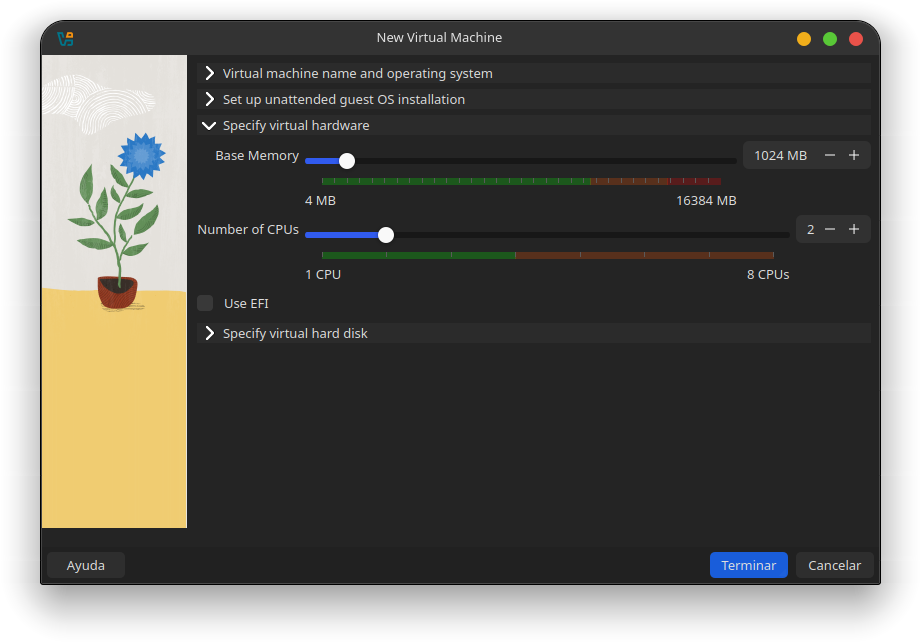

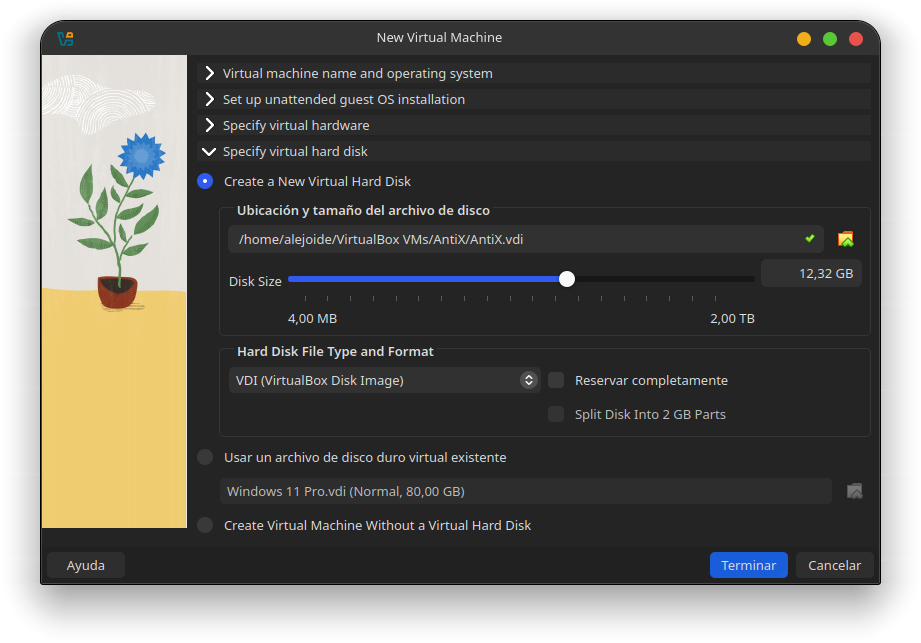

---

## 3. Instalación del Sistema Operativo

### 3.1 Arranque Inicial y Selección del Kernel

Al iniciar la máquina virtual, se presentó el menú GRUB de AntiX Linux. Se seleccionó la opción **"Use Modern Kernel"** para iniciar el sistema operativo con un kernel actualizado.

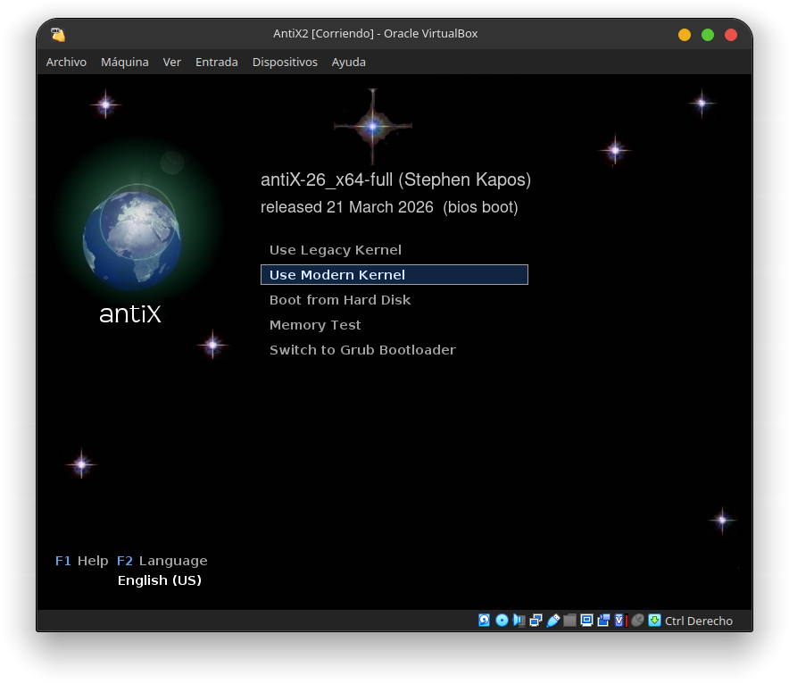

### 3.2 Modo de Arranque

Se procedió a seleccionar el modo de arranque **"normal boot"** para continuar con el proceso de instalación desde el entorno vivo.

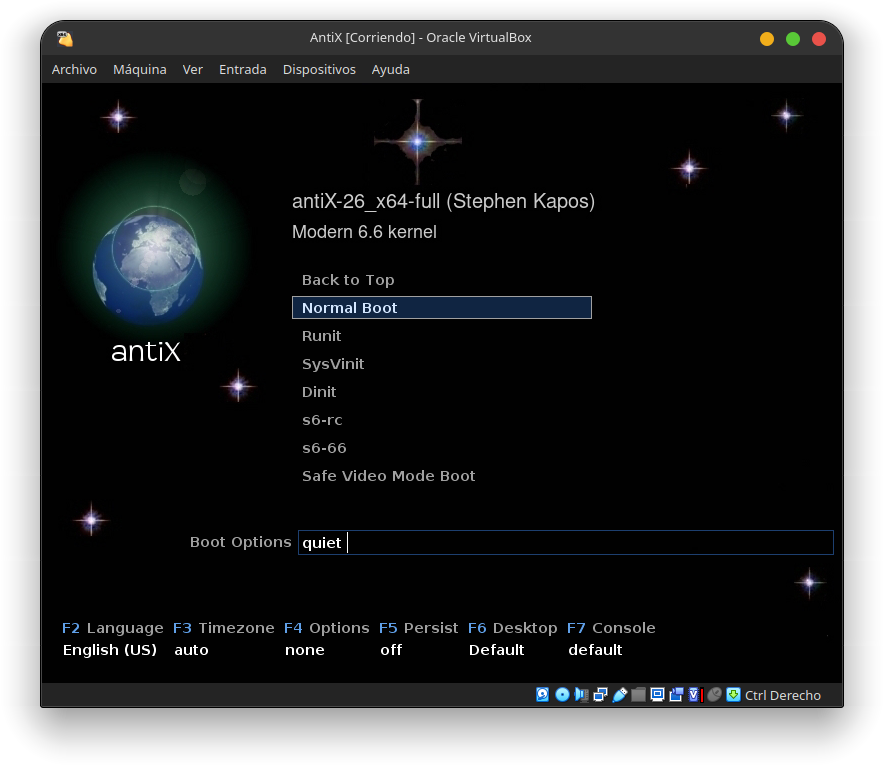

### 3.3 Ejecución del Instalador

Una vez cargado el escritorio, se ejecutó el instalador de AntiX Linux disponible en el entorno gráfico. Posteriormente, se aceptaron los términos de licencia para proceder con la instalación.

### 3.4 Particionamiento del Disco

Se seleccionó la opción **"Use entire disk"** para utilizar la totalidad del espacio disponible en el disco virtual de forma automática. Esto simplifica el proceso de particionamiento sin requerir configuración manual.

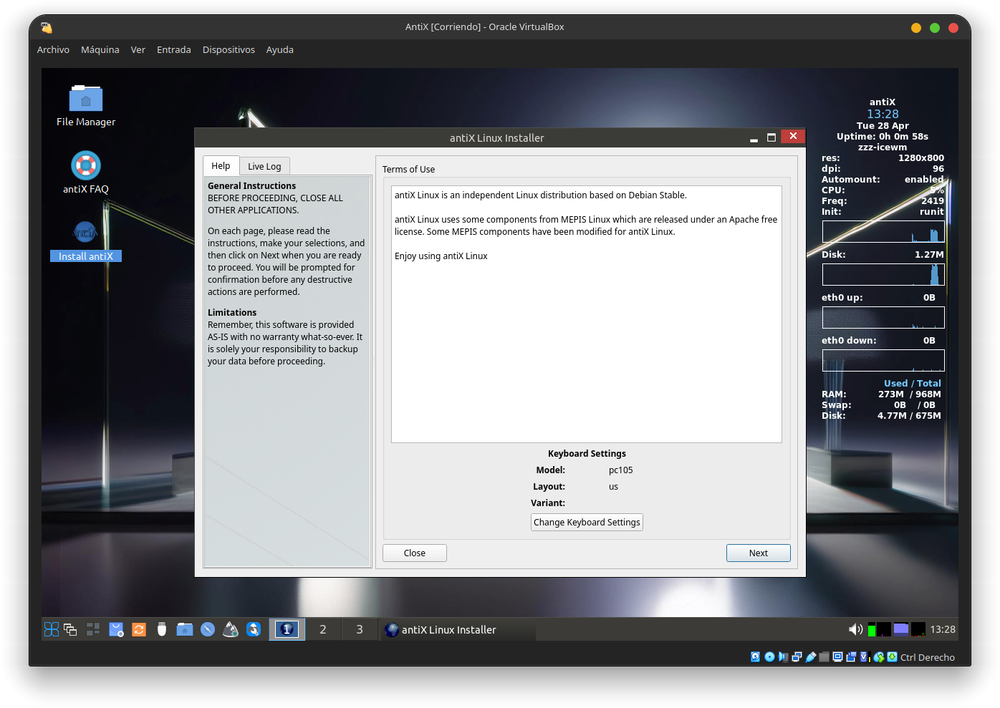

Se solicitó confirmación para escribir los cambios en el disco. Se confirmó la operación presionando **"Start"** para continuar con el proceso de instalación.

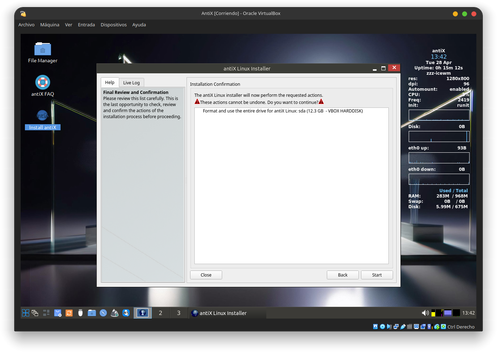

### 3.5 Configuración de Memoria Virtual (Swap)

Se desactivó la asignación de espacio swap durante la instalación, considerando que la máquina virtual cuenta con suficiente memoria RAM (1 GB) para las operaciones esperadas. Esta decisión mejora el rendimiento al evitar lecturas y escrituras innecesarias en disco.

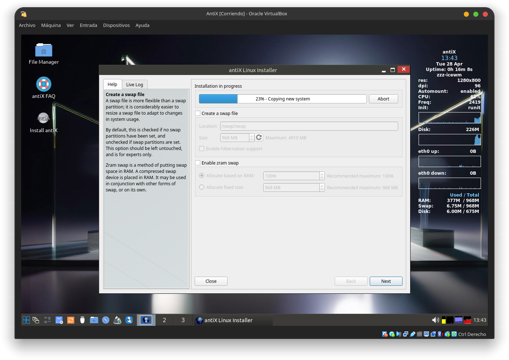

### 3.6 Configuración de Identidad del Sistema

Se estableció la configuración de identidad de la máquina virtual mediante los parámetros:

- **Hostname**: Nombre único para la máquina en la red
- **Dominio**: Dominio local asociado al sistema

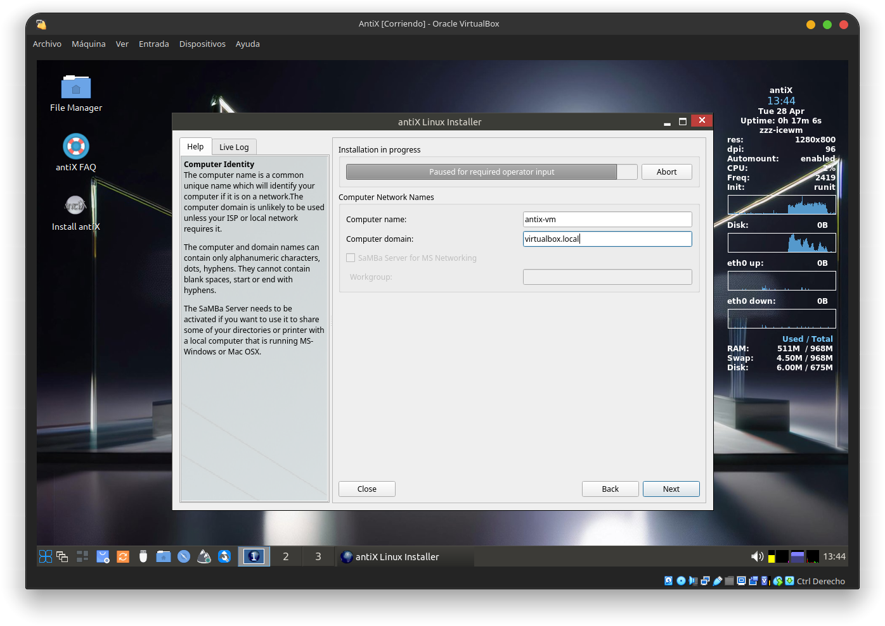

### 3.7 Configuración Regional y Temporal

Se definieron los parámetros de zona horaria, localización e idioma del sistema:

- **Zona horaria**: Establecida según la región de operación
- **Localización**: Configurada para idioma español
- **Hora del sistema**: Sincronizada correctamente

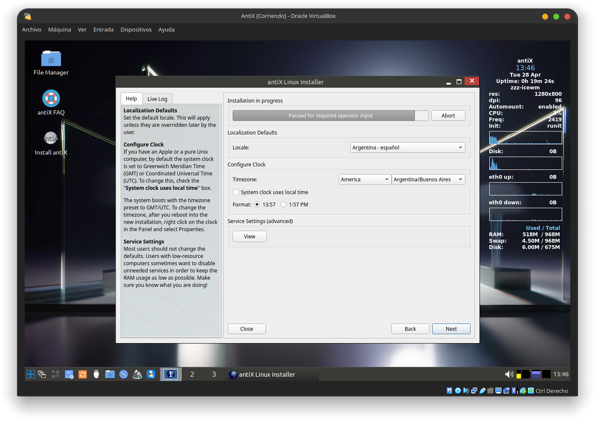

### 3.8 Creación de Usuario y Configuración de Seguridad

Se procedió a crear una cuenta de usuario estándar con credenciales seguras. Se aplicaron las siguientes medidas de seguridad:

- **Autologin deshabilitado**: Se requiere autenticación en cada inicio de sesión
- **Cuenta root deshabilitada**: Se previene el acceso directo como administrador, mejorando la seguridad del sistema

### 3.9 Finalización de la Instalación

Tras completar la configuración anterior, el instalador procedió a compilar la imagen initramfs y finalizar la instalación de forma exitosa. Al concluir, se solicitó reiniciar la máquina virtual para completar el proceso.

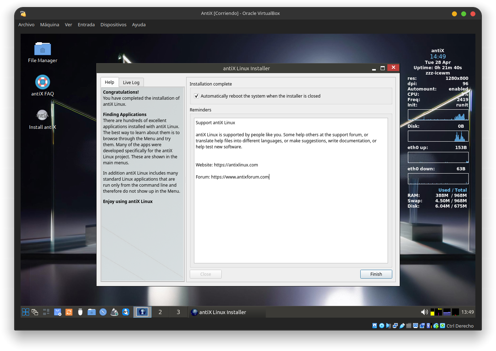

---

## 4. Configuración de Arranque del Sistema

### 4.1 Problema Identificado

Tras el reinicio de la máquina virtual, nuevamente se presentó el menú GRUB del instalador en lugar de arrancar desde el disco duro instalado. Este comportamiento indica que la configuración de arranque de VirtualBox aún apuntaba al archivo ISO de instalación como dispositivo primario.

### 4.2 Corrección de la Configuración de Arranque

Se accedió a la configuración de la máquina virtual en VirtualBox y se removió el archivo ISO de instalación de la lista de dispositivos de arranque. De esta manera, el sistema se configura para arrancar exclusivamente desde el disco duro virtual.

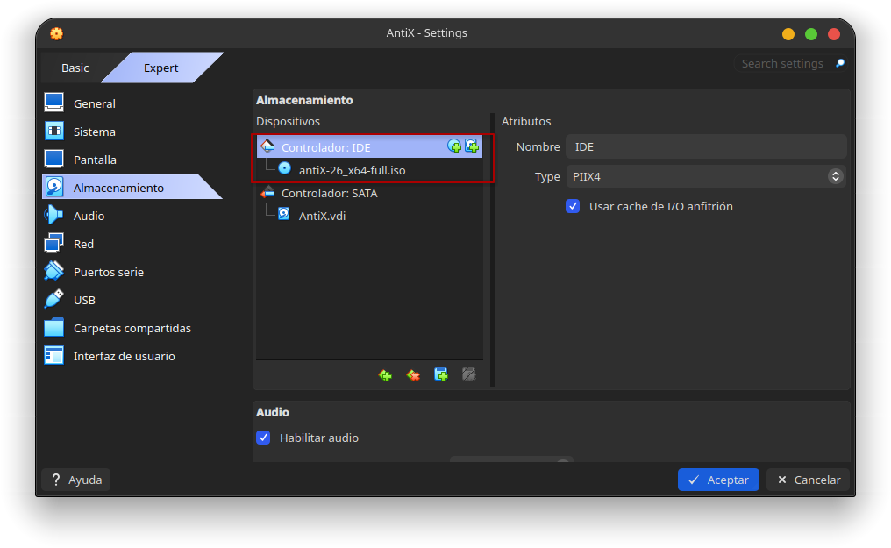

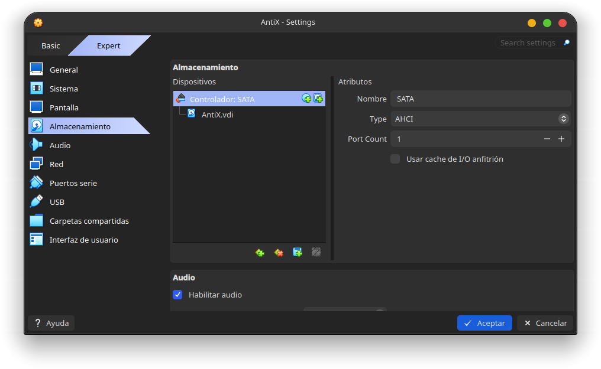

### 4.3 Reinicio y Validación

Se reinició la máquina virtual con la configuración corregida. El sistema procedió a arrancar correctamente desde el disco duro virtual, presentando el menú GRUB con la opción de iniciar AntiX Linux.

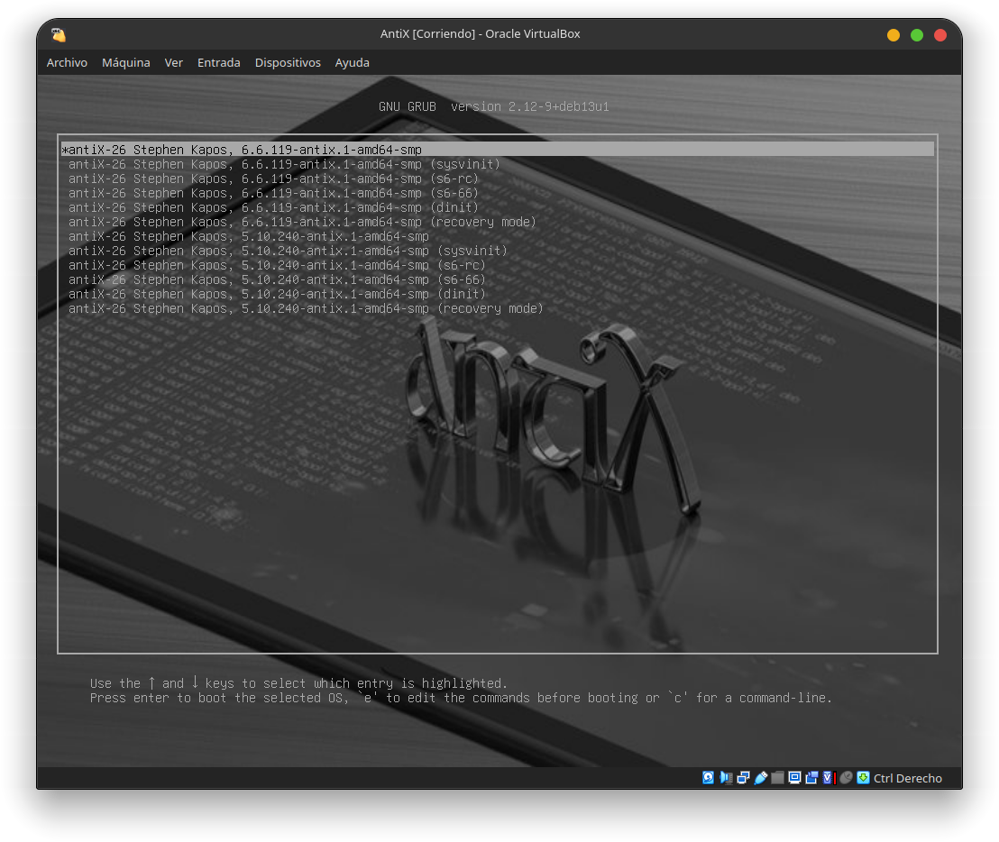

---

## 5. Validación y Verificación Final

### 5.1 Inicio de Sesión

Se seleccionó la primera opción del menú GRUB para iniciar AntiX Linux desde el disco duro. La máquina virtual presentó la pantalla de inicio de sesión, indicando que el sistema operativo se cargó correctamente.

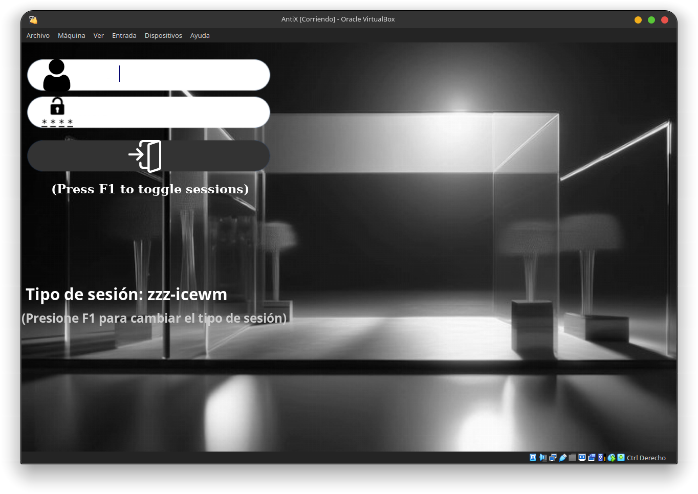

### 5.2 Acceso al Escritorio

Se ingresaron las credenciales del usuario creado durante la fase de instalación. Tras la autenticación exitosa, se accedió al entorno de escritorio de AntiX Linux, confirmando que el proceso de instalación se completó satisfactoriamente.

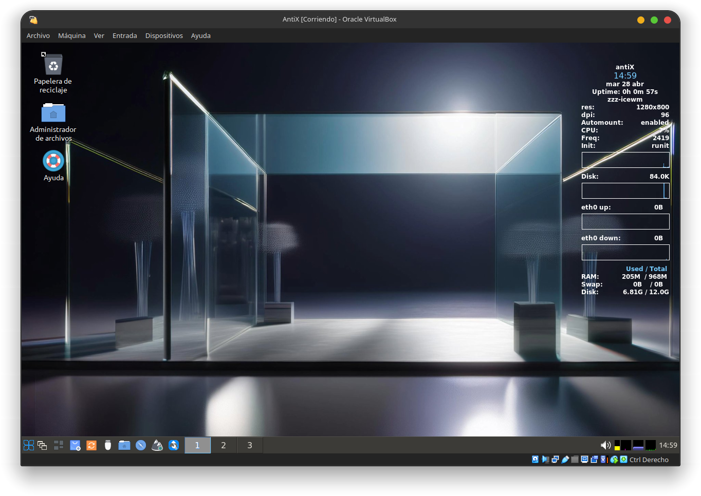

## 6. Configuración de SSH

Es necesario configurar el servicio SSH para permitir conexiones remotas a la máquina virtual. 

Al ejecutar el comando `systemctl status sshd` se observó que AntiX Linux no incluye systemd. Se procedió a ejecutar `pgrep sshd` para verificar si el servicio SSH estaba activo. El resultado indicó que el proceso `sshd` sí estaba en ejecución.

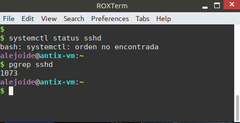

### Port Forwarding para acceso a SSH

Para configurar el acceso remoto a través de SSH, se estableció una regla de port forwarding en VirtualBox. Se asignó el puerto 2222 del host al puerto 22 del guest, permitiendo así la conexión remota al servicio SSH de la máquina virtual.

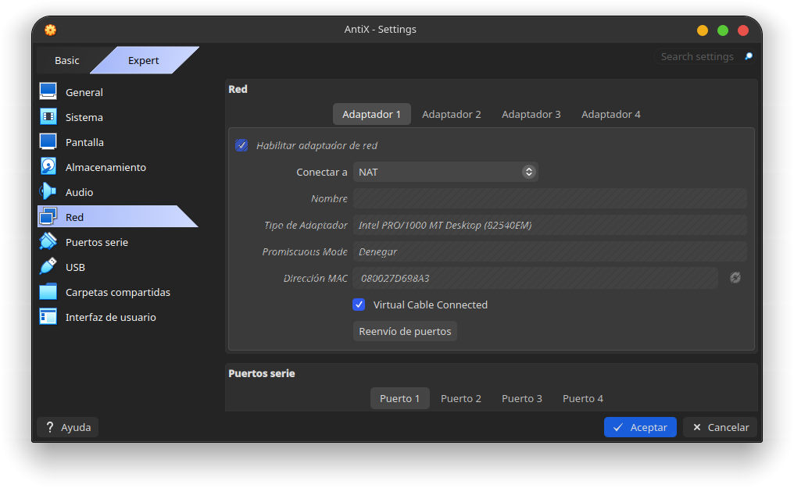

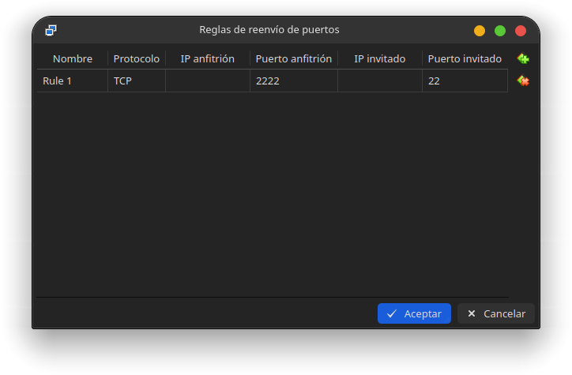

### Verificación de Conexión SSH

Se verifica en el host la conexión SSH utilizando el comando `ssh` con la opción `-p` para especificar el puerto configurado en el port forwarding. La conexión se estableció correctamente, confirmando que el servicio SSH está operativo y accesible desde el host.

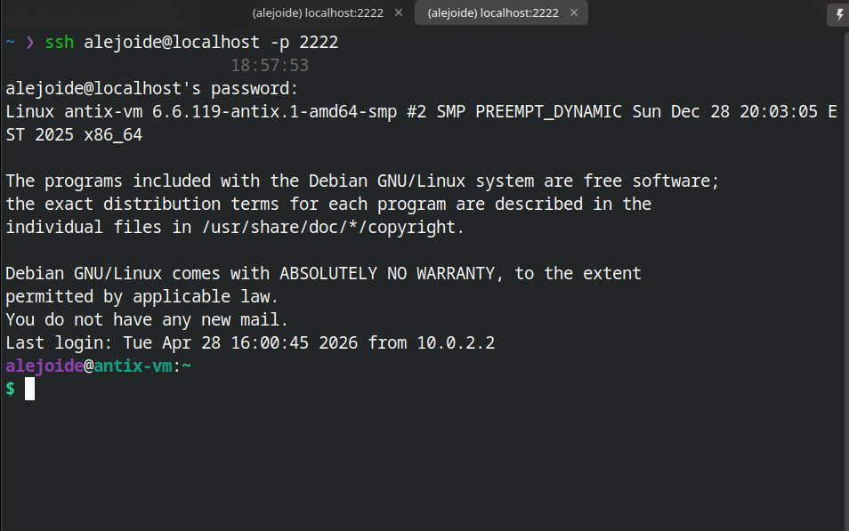

## 7. Actividades Adicionales

### 7.1 Creación de un usuario

Se creó un nuevo usuario con el comando `adduser` para realizar pruebas adicionales de autenticación y permisos en el sistema.

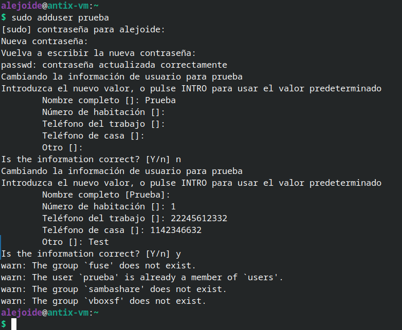

### 7.2 Creación de una carpeta

Se procedió a cambiar de usuario utilizando `su` para acceder al nuevo usuario creado. 

Una vez logueado, se creó una carpeta de prueba en el directorio home del nuevo usuario utilizando el comando `mkdir`. Luego se usó `ls -l` para verificar que la carpeta se creó correctamente.

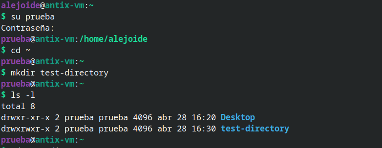

### 7.3 Acceso a la carpeta creada

Se accedió a la carpeta creada utilizando el comando `cd` para verificar que el usuario tiene los permisos adecuados para acceder a su directorio.
Con `pwd` se confirmó la ubicación actual dentro del sistema de archivos, asegurando que el acceso a la carpeta se realizó correctamente.

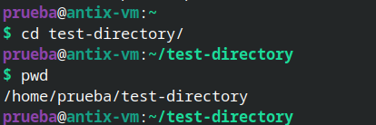

### 7.4 Creación de un archivo de texto

Se creó un archivo de texto utilizando el comando `touch` para generar un nuevo archivo vacío dentro de la carpeta creada.

Otra forma de crear un archivo de texto fue utilizando el comando `echo` para mostrar un mensaje de prueba y redirigir la salida a un nuevo archivo de texto. Esto permitió verificar que el contenido se escribió correctamente en el archivo.

Con `cat` se puede visualizar el contenido del archivo creado para confirmar que se ha escrito correctamente.

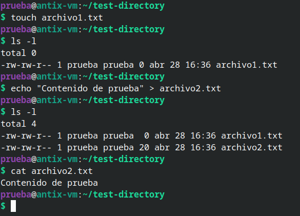

---

## Conclusión

La instalación de AntiX Linux en VirtualBox se realizó exitosamente. Todos los pasos de configuración, instalación y validación se completaron sin inconvenientes significativos. La máquina virtual está lista para su uso operativo, con un sistema operativo funcional, correctamente configurado y con medidas de seguridad implementadas.

Las actividades adicionales realizadas, como la creación de usuarios, carpetas y archivos, confirmaron que el sistema operativo está funcionando correctamente y que los permisos de usuario están configurados adecuadamente.

---

## Notas Técnicas

- El deshabilitamiento de swap fue una decisión consciente, considerando que la asignación de memoria RAM es suficiente para el caso de uso de demostración.
- La remoción del ISO de instalación como dispositivo de arranque es un paso crítico que frecuentemente se omite y causa arrancues desde el instalador.
- Se recomienda crear un snapshot de la máquina virtual tras esta configuración inicial para facilitar futuras pruebas o revertir cambios si es necesario.

